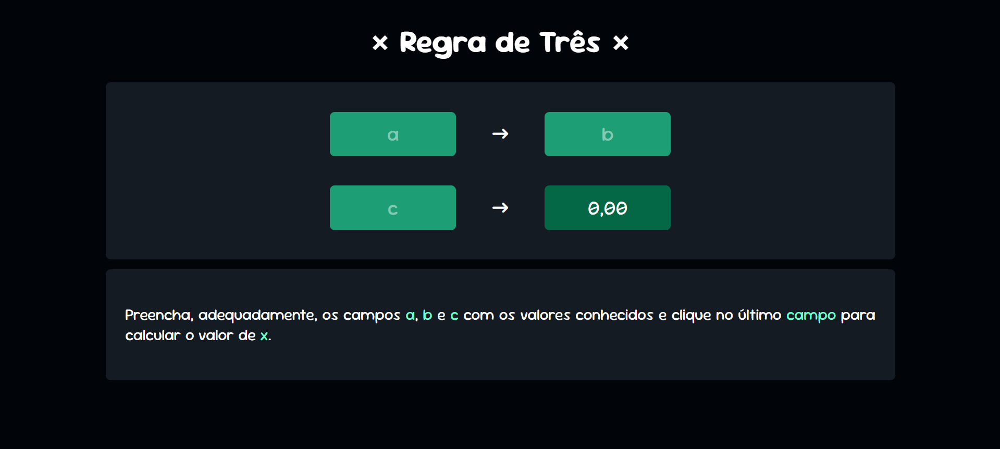
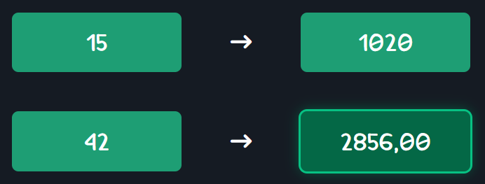

# Projeto: Calculadora de Regra de Três

Este é o meu primeiro projeto desenvolvido em **React**, uma calculadora simples para resolver problemas de regra de três. O objetivo do projeto foi praticar a criação de componentes React, gerenciamento de estado e estilização básica.

<hr>

## Demonstração

Veja abaixo algumas capturas de tela do projeto:

### Exemplo de Preenchimento e Cálculo




<hr>

## Funcionalidades

- Preenchimento dos valores conhecidos nos campos **a**, **b** e **c**.
- Cálculo automático do valor de **x** ao clicar no último campo.
- Formatação de resultado com duas casas decimais.

<hr>

## Tecnologias Utilizadas

- **React**: Biblioteca JavaScript para a construção da interface.
- **CSS**: Estilização dos componentes, com foco em uma interface limpa e intuitiva.
- **JavaScript**: Função de cálculo baseada na regra de três simples.

<hr>

## Como Executar o Projeto

1. **Clone o repositório**:
   ```bash
   git clone https://github.com/seu-usuario/nome-do-repositorio.git
   cd nome-do-repositorio

2. **Instale as dependências**:
   ```bash
   npm install

3. **Execute o projeto**:
   ```bash
   npm start

4. Abra [http://localhost:3000](http://localhost:3000) no navegador para visualizar o projeto.

<hr>

## Estrutura do Projeto

O projeto possui a seguinte estrutura de arquivos:

    ```
    regras_de_tres/
    ├── node_modules/
    ├── public/
    ├── src/
    │   ├── componentes/
    │   │   ├── calcula_r3.ts     # Função de cálculo da regra de três
    │   │   ├── Info.jsx          # Componente com instruções
    │   │   └── Values.jsx        # Componente de entrada de valores
    │   ├── App.css               # Estilos principais da aplicação
    │   ├── App.jsx               # Componente principal
    │   └── index.js              # Ponto de entrada do React
    ├── .gitignore
    ├── package-lock.json
    └── package.json
    ```

<hr>

## Próximos Passos

Este projeto serviu como uma introdução ao React e ao desenvolvimento de interfaces interativas. Em futuros aprimoramentos, pretendo:

- Adicionar validações para entradas de dados.
- Criar testes automatizados para verificar a precisão dos cálculos.

## Conclusão

Esse projeto foi um ótimo ponto de partida para explorar o React e entender o fluxo de dados dentro de componentes. Aprendi bastante sobre gerenciamento de estado, comunicação entre componentes e como estruturar um aplicativo React básico.

